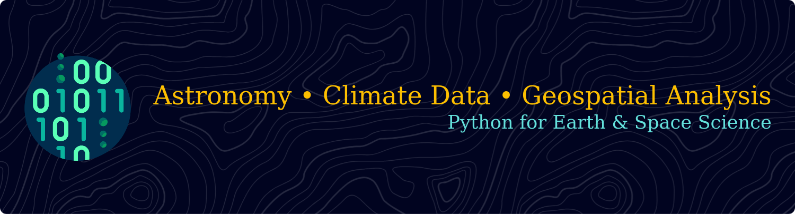

# 💫 About Me:
💡 Active learner, creative problem-solver, and tech enthusiast passionate about blending scientific knowledge, programming, and innovation to tackle real-world challenges.  🔭 Currently exploring Web Development, Machine Learning, and Artificial Intelligence 🤝 Open to collaborating on React and Django projects — and excited to share ideas and learn from others 🚀 Learning to integrate AI tools into workflows to boost productivity 🌱 Expanding skills in front-end and back-end frameworks, with a focus on seamless AI integration

## 🌐 Socials:
  

# 💻 Main Tech Stack:

## 💻 Additional tools, technologies and libraries
                 
# 📊 GitHub Stats:

 
 

## 🏆 GitHub Trophies

### ✍️ Random Dev Quote

---

<!-- Proudly created with GPRM ( https://gprm.itsvg.in ) -->
