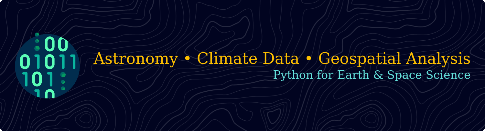

## 👋 Hi, I’m Jude

Astronomy & Astrophysics graduate with a background in computational modelling and scientific analysis.

I work at the intersection of astronomy, climate data and geospatial systems, using Python and Earth Observation data to explore real-world environmental and physical datasets.

Current Focus:
- Climate data analysis using ERA5 reanalysis datasets.
- Geospatial modelling of environmental risks using QGIS.
- Computational astronomy using Astropy for coordinate transformations.

Focused on building scientific computing tools relevant toe Earth observation and environmental challenges in East Africa.

---

## 🚧 Current Work

### 🧪 Science/data identity (primary)

#### ⭐ Stellar Coordinate Explorer (Astropy)
Building a Python tool to transform and visualize stellar coordinates across reference frames using Astropy.

### 🌐 Applications & Systems
💬 Quote Sharing Platform (React + DRF)
A group-based social platform for sharing and engaging with quotes, including API-sourced content and user interaction features (likes, reposts, themed communities).

---

## 🌍 Selected Projects

### 🌡️ ERA5 Temperature Analysis (Python-based Data Analysis + Calibration)
Analysis of surface temperature trends over the Mt. Kenya Lewis Glacier region using ERA5 reanalysis data.
→ Time-series analysis, anomaly detection, climate data processing

### 🌊 Nairobi Flood Analysis (QGIS)
Geospatial flood risk analysis using raster data and GIS techniques
→ Terrain analysis, spatial data processing, visualization

### ⭐ Stellar Coordinate Explorer (Astropy + Scientific Python + Streamlit)
A Python-based tool for transforming and visualizing stellar coordinates across different astronomical reference frames.
→ Astronomical data analysis, coordinate systems, visualization

---

## 🧰 Skills

### 🧪 Scientific & Data Computing
- Python (NumPy, Pandas, SciPy)
- Astropy
- Matplotlib

### 🌍 Geospatial Tools
- QGIS
- Raster & spatial data processing

### 🌐 Application Development
- Flask (data-driven web apps)
- Django (full-stack web applications)
- React (interactive UIs)

---

## 🤝 Interests

Climate & environmental data (especially East Africa 🌍)

Earth observation & geospatial analysis

Computational astronomy

---

## 📌 Explore My Work

Check out the pinned repositories below 👇

<!-- Your new pinned lineup should be:

1. 🌍 ERA5 project

2. 🌊 Nairobi Flood Analysis

3. ⭐ Stellar Coordinate Explorer (even if WIP)

4. 🌌 Planetesimals (after README fix)

5. 💻 ONE strong web app

6. 💻 ONE backup web app (optional) -->

